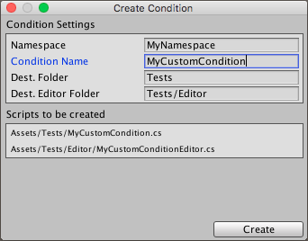
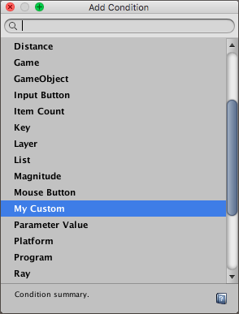
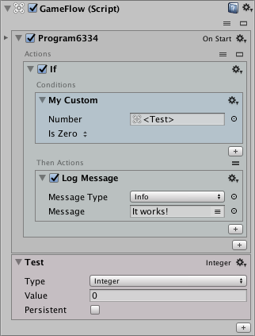

# Custom Conditions

In the same way as in the case of own shares, two scripts are required to create a proper condition:

1. A script that will extend the `Condition` class \(or any of its subclasses\), where the definition of the properties and / or comparisons available for the condition will be made, as well as the implementation of the evaluation from which it is obtained the result of the condition.
2. An Editor script that will extend the `ConditionEditor` class \(or any of its subclasses\) where the interface of the condition that will be shown to the user in the Inspector will be implemented.

## Wizard

To help in the creation of the C \# base code for these scripts, GameFlow has a code generation wizard that can be accessed through the menu option Assets &gt; Create &gt; GameFlow &gt; Condition ...



In this window we can decide the namespace, name of the condition and the destination folders of the two scripts to generate once we click on the Create button.

Once the scripts are generated and the compilation is finished, our new condition should appear already available in the action selection window.



> **Note:** GameFlow automatically suppresses the word "Condition" in the names of the conditions to avoid redundancy.

Of course we can add our condition in those actions that support conditions as if it were any other condition available as a series:



## Generated code

The code generated for the condition script would be this:

```text
using GameFlow;
using UnityEngine;

// An example showing how to implement a basic custom Condition.

namespace MyNamespace {

// Help summary is localized according to current system language.
[Help("en", "Condition summary.", "context-help-url")]
[Help("es", "Resumen condición.", "url-ayuda-contextual")]

// Prevent the Condition from appearing in the Add Component menu.
[AddComponentMenu("")]

public class CustomCondition : Condition {

    // Declare a Variable-friendly property for the condition
    [SerializeField]
    int _number;
    [SerializeField]
    Variable _numberVar;

    // Define a convenience property getter
    public int number {
        // Link basic-type value and Variable reference through an extension method
        get { return _numberVar.GetValue(_number); }
    }

    public enum Comparison {
        IsZero,
        IsNotZero
    }

    [SerializeField]
    Comparison _comparison;

    // Code implementing the evaluation of the Condition
    protected override bool OnEvaluate() {
        // Evaluate according to specified comparison
        switch (_comparison) {
        case Comparison.IsZero:
            return number == 0;
        case Comparison.IsNotZero:
            return number != 0;
        }
        // Default evaluation
        return false;
    }

}

}
```

As we can see, the code is quite similar to the one used to create own shares, only that in this case the method to be implemented would be `OnEvaluate()` and the purpose would be to return the result of the evaluation of the condition based on the value of the properties and the comparison that the user has chosen.

Finally, the code for the script corresponding to the Editor part would be this:

```text
using GameFlow;
using UnityEditor;

namespace MyNamespace {

[CustomEditor(typeof(CustomCondition), true)]
public class CustomConditionEditor : ConditionEditor {

    // Declare properties exactly as defined in the Condition subclass
    protected SerializedProperty _number;
    protected SerializedProperty _numberVar;
    protected SerializedProperty _comparison;

    // Condition user interface
    public override void OnConditionGUI() {
        // Draws a Variable-friendly numeric field in the Inspector
        PropertyField("Number", _number, _numberVar);
        // Draws a label that you can click for additional options
        PopupLabel(_comparison, true);
    }

}

}
```

We will see that this code is also very similar to the one used for the Editor part of an own action, with the difference that in this case the interface is defined in the method `OnConditionGUI()` and we use the method `PopupLabel()` to the selection of the comparison.

## Condition Subclasses

The API of GameFlow offers a series of subclasses of `Condition` that add certain properties and methods of utility, and that can be used to accelerate the writing of own conditions. They are the following:

| Class | Description |
| :--- | :--- |
| [ValueCondition](reference.md#value-condition-class) | Condition that makes use of a Value property, normally for comparison purposes. |

## Evaluation at Edit time

Just as actions can also be executed in Edit mode, GameFlow can also perform a differentiated evaluation of a condition depending on whether it is running in Play or Edit mode.

In the following example, we will modify the previous script to implement a different \(and meaningless, because it is only shown as an example\) evaluation that will be performed only in Edit mode:

```text
using GameFlow;
using UnityEditor;
using UnityEngine;

namespace MyNamespace {

[CustomEditor(typeof(CustomCondition))]
public class CustomConditionEditor : ConditionEditor {

    // Properties as defined in the Action class
    SerializedProperty _number;
    SerializedProperty _numberVar;
    SerializedProperty _comparison;

    // Condition user interface
    public override void OnConditionGUI() {
        // Draws a Variable-friendly numeric field in the Inspector
        PropertyField("Number", _number, _numberVar);
        // Draws a label that you can click for additional options
        PopupLabel(_comparison, true);
    }

    [InitializeOnLoadMethod]
    static void Init() {
        // Set the delegate that will handle the evaluation of the condition in Edit mode
        SetConditionDelegate<CustomCondition>(OnEvaluate);
    }

    static bool OnEvaluate(Condition condition) {
        // Note you can still access condition public properties by using casting:
        return (condition as CustomCondition).number == 1;
    }

}

}
```

As we can see, it is about using the `SetConditionDelegate<T>()` method within the `Init()` method to indicate the method that will take care of the evaluation and implement that method \(`OnEvaluate()` in the example\).

For more information about the operation of the delegation mechanism for evaluating the conditions in Edit mode, consult the entries for the classes [Condition](reference.md#condition-class) and [ConditionEditor](reference.md#conditioneditor-class) in the GameFlow reference.

