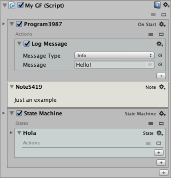

# Templates

One of the most interesting possibilities of our API is the ability to build scripts 'template' programmatically. The steps to follow for this are:

1. Create a C \# script that inherits from `GFBehaviour`.
2. Implement the `OnInit()` method describing the initial configuration of default blocks that we want using methods.

The `OnInit()` method will be executed automatically every time we add our script to a GameObject, allowing us to use a series of specialized methods to add blocks to the script just as we would in the Editor, thus converting the script into a template .

Let's see below the methods to use to add the different types of blocks available in GameFlow.

## Independent blocks

Are those blocks that do not require to be contained in other blocks to exist and therefore can be seen in the primel level or root level of our script derived from `GFBehaviour`. In our example \(see end\) would be the On Start, Note and State Machine blocks.

To add these blocks to the script we use the `AddBlock<T>()` method in which we must replace `T` with the name of the class that represents the block. This method will add the block and return a reference to it that we can use for our next operations.

The list of classes that represent independent blocks is the following:

| Block Type | Class |
| :--- | :--- |
| Program | [Macro](reference.md#macro-class), [OnActivate](reference.md#on-Activate-class), [OnApplicationFocus](reference.md#on-ApplicationFocus-class), [OnApplicationInit](reference.md#on-ApplicationInit-class), [OnApplicationPause](reference.md#on-ApplicationPause-class), [OnApplicationQuit](reference.md#on-ApplicationQuit-class), [OnAwake](reference.md#on-Awake-class), [OnClick](reference.md#on-Click-class), [OnCollisionEnter](reference.md#on-CollisionEnter-class), [OnCollisionEnter2D](reference.md#on-CollisionEnter2D-class), [OnCollisionExit](reference.md#on-CollisionExit-class), [OnCollisionExit2D](reference.md#on-CollisionExit2D-class), [OnCollisionStay](reference.md#on-CollisionStay-class), [OnCollisionStay2D](reference.md#on-CollisionStay2D-class), [OnCustomEvent](reference.md#on-CustomEvent-class), [OnDeactivate](reference.md#on-Deactivate-class), [OnDemand](reference.md#program-class), [OnDeselect](reference.md#on-Deselect-class), [On Destroy](reference.md#on-Destroy-class), [OnDrawGizmos](reference.md#on-DrawGizmos-class), [OnEndEdit](reference.md#on-EndEdit-class), [OnExternalMessage](reference.md#on-ExternalMessage-class), [OnFixedUpdate](reference.md#on-FixedUpdate-class), [OnGameOver](reference.md#on-GameOver-class), [OnGamePause](reference.md#on-GamePause-class), [OnGameResume](reference.md#on-GameResume-class), [OnGameStart](reference.md#on-GameStart-class), [OnLanguageSet](reference.md#on-LanguageSet-class), [OnLateUpdate](reference.md#on-LateUpdate-class), [OnMacroKey](reference.md#macro-class), [OnMouseDown](reference.md#on-MouseDown-class), [OnMouseDrag](reference.md#on-MouseDrag-class), [OnMouseEnter](reference.md#on-MouseEnter-class), [OnMouseExit](reference.md#on-MouseExit-class), [OnMouseOver](reference.md#on-MouseOver-class), [OnMouseUp](reference.md#on-MouseUp-class), [OnParameterChange](reference.md#on-ParameterChange-class), [OnPointerDown](reference.md#on-PointerDown-class), [OnPointerEnter](reference.md#on-PointerEnter-class), [OnPointerExit](reference.md#on-PointerExit-class), [OnPointerUp](reference.md#on-PointerUp-class), [OnProgramFinish](reference.md#on-ProgramFinish-class), [OnSceneLoad](reference.md#on-SceneLoad-class), [OnSelect](reference.md#on-Select-class), [OnStart](reference.md#on-Start-class), [OnTimerExpire](reference.md#on-TimerExpire-class), [OnTriggerEnter](reference.md#on-TriggerEnter-class), [OnTriggerEnter 2D](reference.md#on-TriggerEnter2D-class), [OnTriggerExit](reference.md#on-TriggerExit-class), [OnTriggerExit2D](reference.md#on-TriggerExit2D-class), [OnTriggerStay](reference.md#on-TriggerStay-class), [OnTriggerStay2D](reference.md#on-TriggerStay2D-class), [OnUpdate](reference.md#on-Update-class), [OnValueChange](reference.md#on-ValueChange-class), [OnVariableChange](reference.md#on-VariableChange-class) |
| Data | [List](reference.md#list-class), [Localization](reference.md#localization-class), [Parameter](reference.md#parameter-class), [Variable](reference.md#variable-class) |
| Documentation | [Description](reference.md#description-class), [Note](reference.md#note-class), [Separator](reference.md#separator-class) |
| Tool | [Command](reference.md#command-class), [Force](reference.md#force-class), [Key](reference.md#key-class), [Path](reference.md#path-class), [Pool](reference.md#pool-class), [Ray](reference.md#ray-class), [StateMachine](reference.md#stateMachine-class), [Timer](reference.md#timer-class) |

## Actions

The actions are not independent blocks and therefore must be added using the `AddAction<T>()` method of that program, state or action that will contain it, where `T` must be replaced by the name of the class that represents the action, which will normally be the name of the action without spaces \(for example, the class for the action 'Set Rotation' would be `SetRotation`\). The complete list of available actions can be found in the [Actions Reference](reference.md#actions).

Apart from all programs and states, the list of action classes that support the `AddAction<T>()` method is the following:

| Classes |
| :--- |
| [During](reference.md#during-class), [For](reference.md#for-class), [ForEach](reference.md#forEach-class), [Group](reference.md#group-class), [If](reference.md#if-class), [Loop](reference.md#loop-class), [OnState](reference.md#on-State-class), [Repeat](reference.md#repeat-class), [RepeatUntil](reference.md#repeatUntil-class), [While](reference.md#while-class) |

This method will return a reference to the created action that we can use to, for example, modify some of its properties.

## Conditions

Conditions are even less independent blocks than actions, since they can only be added to a few specific actions that support the `AddCondition<T>` method, where `T` must be replaced by the name of the class representing the condition to be added. The complete list of available conditions can be found in the [Conditions Reference](reference.md#conditions).

The list of action classes that support the `AddCondition<T>()` method is as follows:

| Classes |
| :--- |
| [EvaluateConditions](reference.md#evaluateConditions-class), [If](reference.md#if-class), [RepeatUntil](reference.md#repeatUntil-class), [While](reference.md#while-class) |

This method will return a reference to the created condition that we can use to, for example, modify some of its properties.

## States

The states \(class [State](reference.md#state-class)\) are not independent blocks either, since they can only live within class blocks [StateMachine](reference.md#stateMachine-class). In this case the method to be used is a simple and direct `AddState()` without type specification.

This method will return a reference to the created state that we can use to add actions to it.

## Example

In the following example we will build a custom template script to which we will add a program, a note and a state machine:

```text
using GameFlow;

namespace MyNamespace {

public class MyGF : GFBehaviour {

    protected override void OnInit() {
        // Add a On Start program with a Log Message action
        Program onStart = AddBlock<OnStart>();
        LogMessage logMessage = onStart.AddAction<LogMessage>();
        logMessage.message = "Hello!";
        // Add a Note
        Note note = AddBlock<Note>();
        note.text = "Just an example";
        // Add a State Machine with a State
        StateMachine sm = AddBlock<StateMachine>();
        sm.AddState("Hola");
    }
}

}
```

The result of adding our MyGF script to a GameObject would be this:



