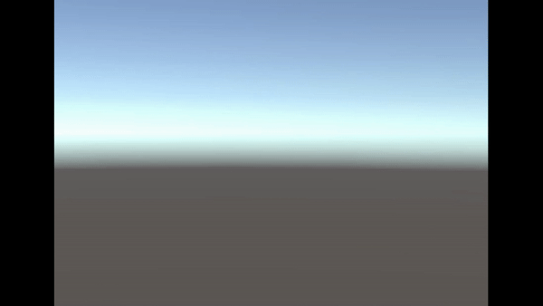
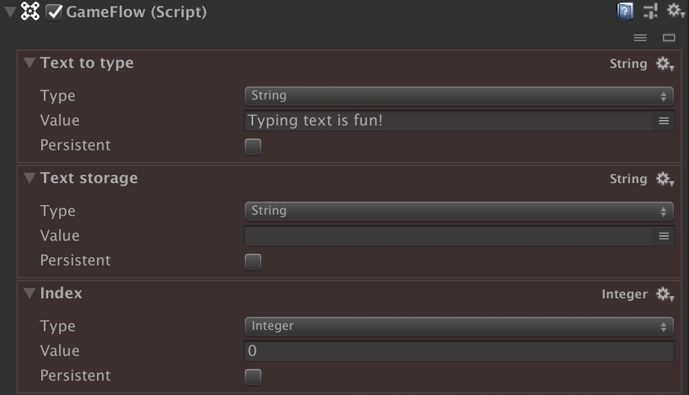
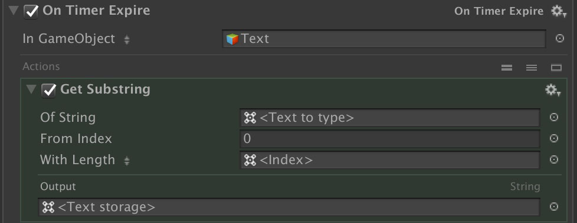
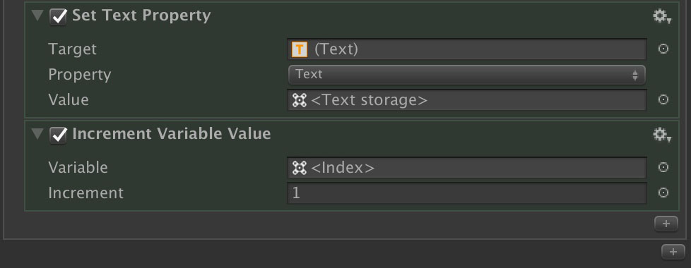
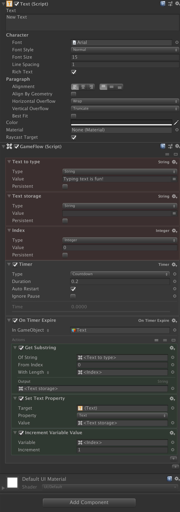

# 05: Typewriter

This is a swift tutorial on how to make a typewriter effect using a [Timer](https://github.com/evasiongames/gameflow/tree/a7421e42f9065333ad7854eb4695e97f45f64d38/docs/ref/blocks/README.md#Timer.md) and a [On Timer Expire](https://github.com/evasiongames/gameflow/tree/a7421e42f9065333ad7854eb4695e97f45f64d38/docs/ref/programs/README.md#OnTimerExpire.md) program. It is assumed that you know about basic GameFlow operations described in the [Basics](https://github.com/evasiongames/gameflow/tree/a7421e42f9065333ad7854eb4695e97f45f64d38/docs/basics.md) chapter of the documentation.

## 1. Scene setup

1. Create a new scene: File menu &gt; New Scene

2. Add a Text object: GameObject menu &gt; UI &gt; Text. A canvas with a text object will be created in the Hierarchy panel.

3. Select the text object and change font size, color and position to what your heart desires.

4. With the text object still selected, click the **Add component** button.

5. Type `GameFlow` and press Return to add the component.

## 2. Adding variables

You now have added GameFlow component in your text object. We will start by adding a few variables.

1. In the inspector window, click the \[＋\] sign at bottom right of the GameFlow component, type `Variable`, hit return to add a variable block. Set the variable to be of type string, rename it to `Text to type`.

2. Click the \[＋\] sign in bottom right again and add a second variable to the GameFlow component, also to be set to type string. It will store the individual characters. Rename it to `Text storage`.

3. Click the \[＋\] sign one more time to add the third variable to the GameFlow component, set it to type Integer. It will store the number of characters that we type. Rename it to `Index`.

> Tip 1: Renaming every component is a good convention - it makes debugging easier as your code grows.

## 3. Adding a timer

We need a timer to control how fast the characters are printed on screen.

Press the \[＋\] sign at the bottom right of the GameFlow block. Type `Timer` in the search field and add the Timer action. Choose type Countdown, and set Duration to 0.2 seconds. Also important: Tick the Auto Restart box - then the timer will restart every time it is down to zero.

> Tip 2:you do not have to type all search characters in the search field. GameFlow will automatically estimate what you are looking for, so you can add it without writing the whole search phrase.

## 4. Main program

We now need a way to control the typing. We need a program that executes each time the timer is down to zero. The **On Timer Expire** program is the perfect candidate.

1. Press the \[＋\] sign at the bottom of the GameFlow component, type in `On Timer Expire`, hit return to add it. Rename block to `Main program`.

2. Press the \[＋\] sign below the **On Timer Expire** component . In the search field, type `Get Substring`, hit return to add the block.

3. Now we need to tell the **Get Substring** component where to get its input and output data. Choose variable `<Text to type>` in the 'Of String' field, and `<Index>` variable in the 'With Length' field. As Output choose `<Text storage>` variable.

## 5. Updating the text

Ok, now we have the the basics, we just need to update the text field every time the timer expires, so all code we add to the On Timer Expire component, will be executed every time the timer is down to zero.

Then we need to do one last operation every time the timer expires: Tell it to increase the number of character to be typed. We do that simply by adding one to the `<Index>` variable.

1. Press the \[＋\] sign at the bottom of the On Timer Expire component, search for `Set Text Property`, hit return to add it. As **Value** choose the `<Text storage>` variable.

2. Press the \[＋\] sign at the bottom of the On Timer Expire component, search for «Increment Variable Value». Then we need to tell the component increase the `<Index>` variable by 1.

Ok, press play, and see your text being typed on the screen. Alter the timer duration in the Timer Component to type at your desired speed. Here is the whole GameFlow chain of blocks:

Thank you for reading this tutorial.

## 

[Johnny Holmvåg](05.md)

